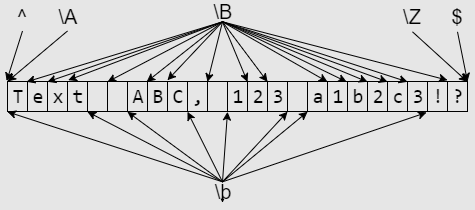
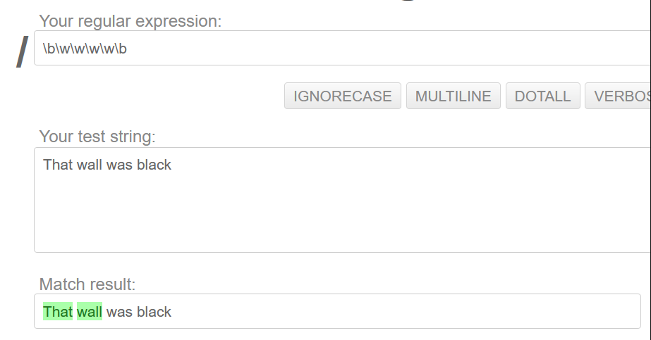
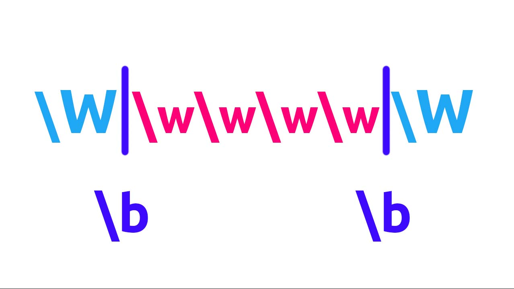
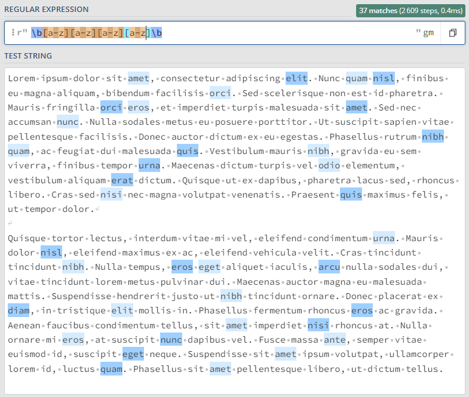
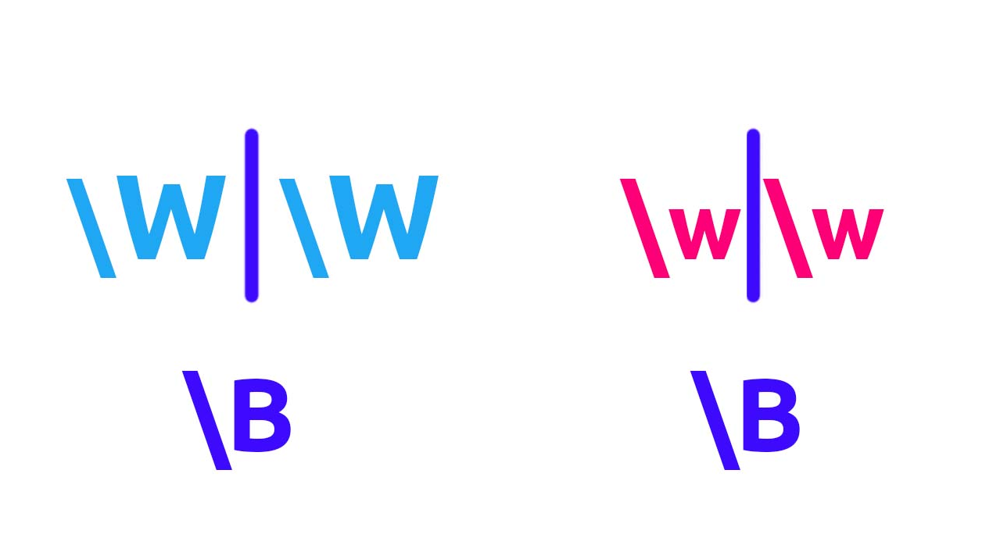
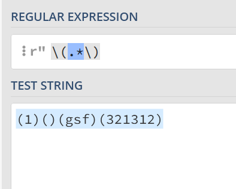
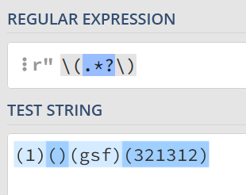

# Regular expressions

# Квадратные скобки

Использование квадратных скобок

1) Если мы хотим заменить один из указанных нескольких символов, мы можем использовать такой синтаксис с квадратными скобками:

```python
r'[cr1]'     # Найдёт c, r, и 1
r'[cr]at'    # Найдёт слова cat и rat
r'[12]7[56]' # Найдёт 175, 176, 275, 276
```

От перестановки символов смысл не меняется:

```python
r'[cr1]' # Найдёт c, r, и 1
r'[rc1]' # Найдёт c, r, и 1
r'[1cr]' # Найдёт c, r, и 1
r'[1rc]' # Найдёт c, r, и 1
r'[c1r]' # Найдёт c, r, и 1
r'[r1c]' # Найдёт c, r, и 1
# Все регулярные выражения сверху выдают один и тот же результат
```

2) Если мы хотим исключить какие-либо символы, мы можем использовать скобки так:

```python
r'[^12]'  # Найдёт всё, кроме 1 и 2
r'[^12]7' # Найдёт все последовательности, что заканчиваются на 7, и не начинаются на 1 и 2
```

Достаточно перед символами, которые мы хотим исключить, прописать символ `^`.

Если символ `^` не стоит в начале скобок или он экранирован - он воспринимается как обычный текст:

```python
r'[0^]_[0^]' # Найдёт 0_0, 0_^, ^_0, ^_^
r'[\^0]_[\^0]' # Найдёт 0_0, 0_^, ^_0, ^_^
```

3) Регулярное выражение в скобках можно сократить вот так:

```python
r'[0-9]' # То же самое, что и [0123456789]
r'[a-z]' # То же самое, что и [abcdefghijklmnopqrstuvwxyz]
r'[A-Z]' # То же самое, что и [ABCDEFGHIJKLMNOPQRSTUVWXYZ]
r'[а-я]' # То же самое, что и [абвгдежзийклмнопрстуфхцчшщъыьэюя]
r'[А-Я]' # То же самое, что и [АБВГДЕЖЗИЙКЛМНОПРСТУФХЦЧШЩЪЫЬЭЮЯ]
```

Можно получать неполный алфавит, или не все цифры:

```python
r'[4-7]' # То же самое, что и [4567]
r'[x-z]' # То же самое, что и [xyz]
r'[B-D]' # То же самое, что и [BCD]
r'[а-ж]' # То же самое, что и [абвгдеж]
r'[П-Т]' # То же самое, что и [ПРСТ]
r'[6-D]' # То же самое, что и [6789:;<=>?@ABCD]
```

А также совмещать синтаксис:

```python
r'[4-7qwerty]' # То же самое, что и [qwerty4567]
r'[23x-z1]'    # То же самое, что и [xyz123]
r'[B-DF]'      # То же самое, что и [BCDF]
```

Распространённая ошибка: регулярное выражение `[21-47]` не найдёт числа от 21 до 47, оно будет равносильно выражению `[212347]`.

Чтобы использовать `-` как обычный символ - его достаточно экранировать или поставить в конец или начало скобок:

```python
r'[4\-7]' # Найдёт 4, -, и 7
r'[-xz]'  # Найдёт -, x, и z
r'[^-xz]' # Найдёт всё, кроме -, x, и z
r'[BD-]'  # Найдёт B, D, и -
```

4) Исключение символов можно тоже сократить:

```python
r'[^0-9]' # То же самое, что и [^0123456789]
r'[^a-z]' # То же самое, что и [^abcdefghijklmnopqrstuvwxyz]
r'[^A-Z]' # То же самое, что и [^ABCDEFGHIJKLMNOPQRSTUVWXYZ]
r'[^а-я]' # То же самое, что и [^абвгдежзийклмнопрстуфхцчшщъыьэюя]
r'[^А-Я]' # То же самое, что и [^АБВГДЕЖЗИЙКЛМНОПРСТУФХЦЧШЩЪЫЬЭЮЯ]
```

Можно исключать неполный алфавит, или не все цифры:

```python
r'[^4-7]' # То же самое, что и [^4567]
r'[^x-z]' # То же самое, что и [^xyz]
r'[^B-D]' # То же самое, что и [^BCD]
r'[^а-ж]' # То же самое, что и [^абвгдеж]
r'[^П-Т]' # То же самое, что и [^ПРСТ]
r'[^6-D]' # То же самое, что и [^6789:;<=>?@ABCD]
```

Ну и совмещать:

```python
r'[^4-7qwerty]' # То же самое, что и [^qwerty4567]
r'[^23x-z1]'    # То же самое, что и [^xyz123]
r'[^B-DF]'      # То же самое, что и [^BCDF]
```

5) Можно использовать столько сокращений, сколько мы захотим:

```
r'[a-zA-Z0-9]' # То же самое, что [abcdefghijklmnopqrstuvwxyzABCDEFGHIJKLMNOPQRSTUVWXYZ0123456789]
r'[^э-я1-3]'   # То же самое, что и [^эюя123]
```

6) Если квадратные скобки нужно использовать как обычный текст - достаточно их просто экранировать:

```python
r'\[\]' # Найдет []
```

Обратите внимание, что шаблон `[а-яА-Я]` не захватывает буквы `ё` и `Ё`. Если они вам понадобятся - придётся указывать их вручную: `[а-яА-ЯёЁ]`

# Шаблоны

В регулярных выражениях можно использовать специальные шаблоны, которые могут соответствовать каким-либо символам или не соответствовать ни одному символу вообще, но служить проверкой для тестовых данных.

## Часто используемые шаблоны

| Шаблон | Соответствие |
| --- | --- |
| \n | Новая строка |
| . | Любой символ, кроме символа новой строки. Если flags=re.DOTALL - любой символ. |
| \s | Любой символ пробела, табуляции или новой строки. |
| \S | Любой символ, кроме пробела, табуляции или новой строки. |
| \d | Любая цифра. Ищет все цифры: арабские, персидские, индийские, и так далее. Не эквивалентен [0-9] |
| \D | Любой символ, кроме цифр. |
| \w | Любая буква, цифра, или _. Шаблон не соответствует выражению [a-zA-Z0-9_]! Буквы используются не только латинские, туда входит множество языков. |
| \W | Любой символ, кроме букв, цифр, и _. |
| \b | Промежуток между символом, совпадающим с \w,
и символом, не совпадающим с \w в любом порядке. |
| \B | Промежуток между двумя символами,
совпадающими с \w или \W. |
| \A | Начало всего текста |
| \Z | Конец всего текста |
| ^ | Начало всего текста или начало строчки текста, если flags=re.MULTILINE |
| $ | Конец всего текста или конец строчки текста, если flags=re.MULTILINE |

## Остальные шаблоны

| Шаблон | Соответствие |
| --- | --- |
| \r | carriage return или CR, символ Юникода U+240D. |
| \t | Tab символ |
| \0 | null, символ Юникода U+2400. |
| \v | Вертикальный пробел в Юникоде |
| \xYY | 8-битный символ с заданным шестнадцатеричным значением. https://unicode-table.com/en/ Например \x2A находит символ *. |
| \ddd | 8-битный символ с заданным восьмеричным значением. https://www.utf8-chartable.de/unicode-utf8-table.pl?utf8=oct Например \052 находит символ *. |
| [\b] | Символ backspace или BS.
В скобках, т.к. \b уже занято другим спецсимволом. |
| \f | Символ разрыва страницы. |

## **Вариации использования**

Некоторые спецсимволы, например такие: `$^.-[]`, используются по-разному в регулярных выражениях в зависимости от контекста:

**`$`**

```python
r'[A$Z]'  # Ищет символы A,$,Z
r'^text$' # Ищет text между началом и концом строки
r'100\$'  # Ищет 100$
```

**`^`**

```python
r"[^abc]"      # Ищет любой символ, кроме a,b,c
r"^Some text$" # Ищет Some text между началом и концом строки
r"\^"          # Ищет символ ^
r"[a^bc]"      # Символ ^ не стоит первым в скобках, поэтому выражение ищет символы a,b,c,^
```

**`.`**

```python
r'[A.Z]'     # Ищет символы A,.,Z
r'text.'     # Ищет text с любым символом, кроме перехода на новую строку
r'1\.000\$'  # Ищет 1.000$
```

`-`

```python
r'Как-то так' # Ищет Как-то так
r'[+-]'       # Ищет символы +,-
r'[^-+]'      # Ищет любой символ, кроме +, -
r'[a-z]'      # Ищет все буквы латинского алфавита в нижнем регистре
r'[a\-z]'     # Ищет символы a,-,z
```

**`[]`**

```python
r'[abc]'   # Ищет символы a,b,c
r'\[abc\]' # Ищет [abc]
r'[\[abc\]]' # Ищет символы [,a,b,c,]
```

Таких уникальных способов применения шаблонов много, сгруппировать их по какому-то признаку сложно, поэтому придётся просто запомнить каждый случай отдельно.

## **Шаблоны и квадратные скобки**

Не все шаблоны в квадратных скобках используются как текстовые символы:

```python
r'[.]'  # Находит точку

r'[\d]' # То же самое, что и \d
```

## **`\b` и `\B`**

Заметил, что все путаются с этими двумя шаблонами. Если остальные ещё можно понять, то тут действительно непонятное описание, которое может ввести в ступор. Особенно если добавить ко всему этому факт, что шаблоны `\b` и `\B` являются "пустыми" и не занимают места в тексте, они являются промежутком между символами, в следствие чего их невозможно увидеть.



### **`\b`**

Очень часто используется как граница слова или числа. Он стоит между `\w` и `\W` и не зависит от того, в каком порядке они расположены: он будет как между `\w\W`, так и между `\W\w`.

Представим, что у нас есть следующий текст и такое регулярное выражение:

```jsx
text = 'That wall was black'
regex = r'\b\w\w\w\w\b'

# Регулярное выражение найдёт следующие последовательности:
# That, wall

# Попытаемся понять, почему так произошло
# Давайте попробуем сопоставить тестовой строке text шаблоны \w и \W
# Теперь наглядно видно, почему наше регулярное выражение находит именно такие последовательности

# That
# \W\b\w\w\w\w\b\W
# Перед словом стоит начало строки, оно не относится к \w, поэтому будет отнесёно к \W
# Тут стоит промежуток \b, так как по бокам от него "противоположные" символы \w и \W
# Идут четыре латинских буквы разного регистра. Они принадлежат \w
# Тут стоит промежуток \b, так как по бокам от него "противоположные" символы \w и \W
# Пробел не принадлежит \w, значит он принадлежит \W

# wall
# \W\b\w\w\w\w\b\W
# Пробел не принадлежит \w, значит он принадлежит \W
# Тут стоит промежуток \b, так как по бокам от него "противоположные" символы \w и \W
# Идут четыре латинских буквы. Они принадлежат \w
# Тут стоит промежуток \b, так как по бокам от него "противоположные" символы \w и \W
# Пробел не принадлежит \w, значит он принадлежит \W

# was
# \W\b\w\w\w\b\W
# Перед строкой стоит пробел, относим его к \W
# Тут стоит промежуток \b, так как по бокам от него "противоположные" символы \w и \W
# 3 латинских буквы, относим их к \w
# Тут стоит промежуток \b, так как по бокам от него "противоположные" символы \w и \W
# Снова пробел, это будет \W

# black
# \W\b\w\w\w\w\w\b\W
# Перед строкой стоит пробел, относим его к \W
# Тут стоит промежуток \b, так как по бокам от него "противоположные" символы \w и \W
# 5 латинских буквы, относим их к \w
# Тут стоит промежуток \b, так как по бокам от него "противоположные" символы \w и \W
# Конец строки это \W

# Слова was и black не были найдены регулярным выражением, из-за того что не подходили по длине
```



Примерно так промежуток `\b` "появляется" между `\w\W` и `\w\W`:



- Голубая `\W` - в верхнем регистре.
- Розовая `\w` - в нижнем.
- Фиолетовые "палочки" - промежутки `\b`.

Давайте посмотрим, как применить это на практике.

Напишем регулярное выражение, которое ищет 4-буквенные английские слова:



Также с помощью `\b` можно искать числа, например, `\b123\b` найдёт все числа 123, окружённые любым символом, кроме `\w`, то есть всё, кроме букв, цифр, и символа `_`.

### **В чём же подвох?**

Если вам нужны более точные совпадения, то использовать `\b` как границу слова или числа не стоит. Приведу в пример регулярное выражение `\b123\b`, что написано выше:

```jsx
Оно найдёт 123 в следующих примерах:
#123%
 123 
123
(123)
^123$
-123.

И пропустит 123 в этих примерах:
a123b
g123
123g
123_
_123
11234
```

Регулярное выражение пропускает все числа 123, если рядом с ними будут написаны любые символы из шаблона `\w`: буквы, цифры, `_`.

Мы будем использовать `\b` для поиска слов и чисел только в начале курса. Позже научимся искать нужные строки более точно.

### **`\B`**

Промежуток между `\w\w` и `\W\W`:



- Голубая `\W` - в верхнем регистре.
- Розовая `\w` - в нижнем.
- Фиолетовые "палочки" - символы `\B`.

Если составим регулярное выражение `\B123\B`, то получим такой результат:

```jsx
Оно найдёт 123 в следующих примерах:
a123b
11234

И пропустит 123 в этих примерах:
#123%
 123 
123
(123)
^123$
-123.
g123
123g
123_
_123
```

`\B` может понадобится, если вам нужно найти какую-то строку, состоящую из символов `\w` или `\W`, а также окружённую такими же символами `\w` или `\W`.

# **Квантификаторы**

Очень часто, когда нужно использовать несколько шаблонов подряд, приходится их писать друг за другом. Например, если мы хотим найти 3 цифры подряд мы напишем:

```python
r'\d\d\d'
```

Но теперь, мы можем сократить эту запись вот так, используя квантификаторы:

```python
r'\d{3}'
```

## **Что же такое квантификатор?**

Квантификатор - конструкция, которая позволяет указывать количество повторений.

| Квантификатор | Использование |
| --- | --- |
| {n} | Ровно n повторений |
| {m,n} | От m до n повторений. |
| {m,} | Не менее m повторений |
| {,n} | Не более n повторений |
| ? | Ноль или одно повторение
То же, что и {0,1} |
| * | Ноль или более повторений
То же, что и {0,} |
| + | Одно или более повторенийТо же, что и {1,} |

Интересные факты о квантификаторах:

- В каждом квантификаторе учитываются и начало, и конец отрезка.
- Каждый квантификатор по умолчанию - жадный. Жадные квантификаторы пытаются захватить как можно больше символов.

# **Жадные и ленивые квантификаторы**

## **Жадные квантификаторы**

Все квантификаторы, которые были пройдены в прошлом уроке - по умолчанию жадные. Они пытаются захватить максимальное количество символов.

```
Жадные квантификаторы:

{m,n}
{,n}
{m,}
*
+
?
```

## **Но что делать, если не всегда нужно находить самое длинное вхождение?**

Например, есть тестовая строка `(1)()(gsf)(321312)` и нужно найти все скобки и их содержимое. Напишем выражение `r"\(.*\)"`, но оно работает не так, как нам нужно:



Выражение пытается найти самое большое вхождение. Давайте попробуем использовать ленивый квантификатор:



Отлично, мы нашли каждое вхождение по отдельности!

## **Ленивые квантификаторы**

Если после квантификатора поставить знак `?`, то можно его сделать ленивым. Тогда он будет захватывать минимальное количество символов.

```
Ленивые квантификаторы

{m,n}? - от m до n
{,n}? - до n
{m,}? - от m
*? - от 0
+? - от 1
?? - от 0 до 1

Каждый из этих квантификаторов будет пытаться захватить как можно меньше символов.
```

Обратите внимание, что жадность меняет работу всех квантификаторов, кроме квантификатора `{n}`. Но это и логично, так как в любом случае он будет искать нужную последовательность `n` раз, независимо от его жадности. Квантификатор `{n}` будет равносилен квантификатору `{n}?`, правда в последнем нет никакого смысла.