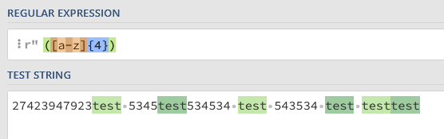
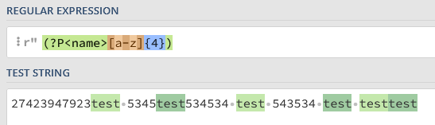
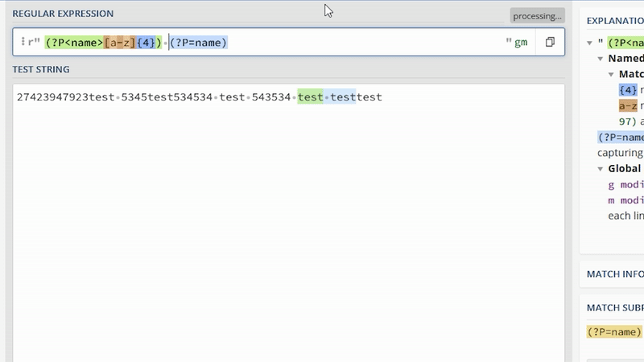
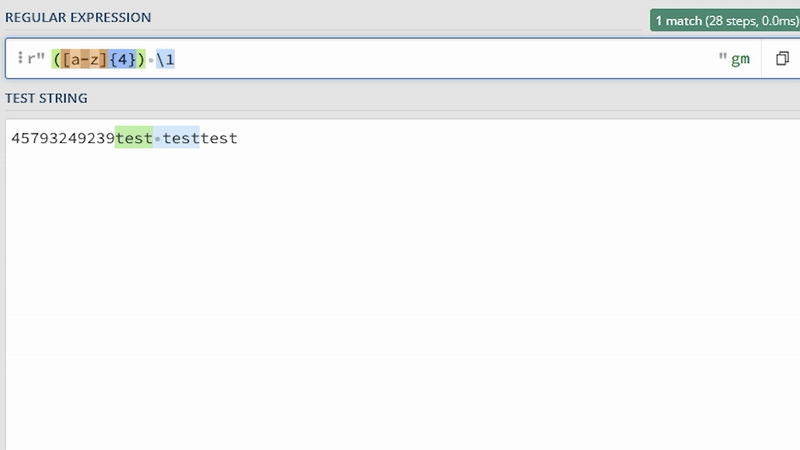
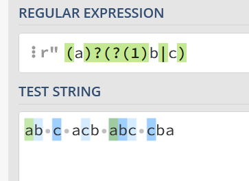
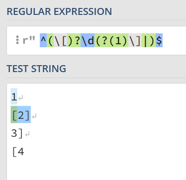
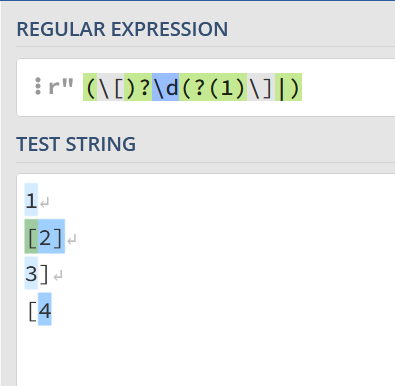
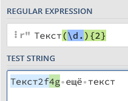
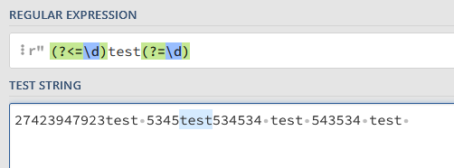
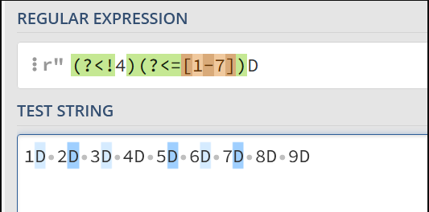

# Regular expressions

# Квадратные скобки

Использование квадратных скобок

1) Если мы хотим заменить один из указанных нескольких символов, мы можем использовать такой синтаксис с квадратными скобками:

```python
r'[cr1]'     # Найдёт c, r, и 1
r'[cr]at'    # Найдёт слова cat и rat
r'[12]7[56]' # Найдёт 175, 176, 275, 276
```

От перестановки символов смысл не меняется:

```python
r'[cr1]' # Найдёт c, r, и 1
r'[rc1]' # Найдёт c, r, и 1
r'[1cr]' # Найдёт c, r, и 1
r'[1rc]' # Найдёт c, r, и 1
r'[c1r]' # Найдёт c, r, и 1
r'[r1c]' # Найдёт c, r, и 1
# Все регулярные выражения сверху выдают один и тот же результат
```

2) Если мы хотим исключить какие-либо символы, мы можем использовать скобки так:

```python
r'[^12]'  # Найдёт всё, кроме 1 и 2
r'[^12]7' # Найдёт все последовательности, что заканчиваются на 7, и не начинаются на 1 и 2
```

Достаточно перед символами, которые мы хотим исключить, прописать символ `^`.

Если символ `^` не стоит в начале скобок или он экранирован - он воспринимается как обычный текст:

```python
r'[0^]_[0^]' # Найдёт 0_0, 0_^, ^_0, ^_^
r'[\^0]_[\^0]' # Найдёт 0_0, 0_^, ^_0, ^_^
```

3) Регулярное выражение в скобках можно сократить вот так:

```python
r'[0-9]' # То же самое, что и [0123456789]
r'[a-z]' # То же самое, что и [abcdefghijklmnopqrstuvwxyz]
r'[A-Z]' # То же самое, что и [ABCDEFGHIJKLMNOPQRSTUVWXYZ]
r'[а-я]' # То же самое, что и [абвгдежзийклмнопрстуфхцчшщъыьэюя]
r'[А-Я]' # То же самое, что и [АБВГДЕЖЗИЙКЛМНОПРСТУФХЦЧШЩЪЫЬЭЮЯ]
```

Можно получать неполный алфавит, или не все цифры:

```python
r'[4-7]' # То же самое, что и [4567]
r'[x-z]' # То же самое, что и [xyz]
r'[B-D]' # То же самое, что и [BCD]
r'[а-ж]' # То же самое, что и [абвгдеж]
r'[П-Т]' # То же самое, что и [ПРСТ]
r'[6-D]' # То же самое, что и [6789:;<=>?@ABCD]
```

А также совмещать синтаксис:

```python
r'[4-7qwerty]' # То же самое, что и [qwerty4567]
r'[23x-z1]'    # То же самое, что и [xyz123]
r'[B-DF]'      # То же самое, что и [BCDF]
```

Распространённая ошибка: регулярное выражение `[21-47]` не найдёт числа от 21 до 47, оно будет равносильно выражению `[212347]`.

Чтобы использовать `-` как обычный символ - его достаточно экранировать или поставить в конец или начало скобок:

```python
r'[4\-7]' # Найдёт 4, -, и 7
r'[-xz]'  # Найдёт -, x, и z
r'[^-xz]' # Найдёт всё, кроме -, x, и z
r'[BD-]'  # Найдёт B, D, и -
```

4) Исключение символов можно тоже сократить:

```python
r'[^0-9]' # То же самое, что и [^0123456789]
r'[^a-z]' # То же самое, что и [^abcdefghijklmnopqrstuvwxyz]
r'[^A-Z]' # То же самое, что и [^ABCDEFGHIJKLMNOPQRSTUVWXYZ]
r'[^а-я]' # То же самое, что и [^абвгдежзийклмнопрстуфхцчшщъыьэюя]
r'[^А-Я]' # То же самое, что и [^АБВГДЕЖЗИЙКЛМНОПРСТУФХЦЧШЩЪЫЬЭЮЯ]
```

Можно исключать неполный алфавит, или не все цифры:

```python
r'[^4-7]' # То же самое, что и [^4567]
r'[^x-z]' # То же самое, что и [^xyz]
r'[^B-D]' # То же самое, что и [^BCD]
r'[^а-ж]' # То же самое, что и [^абвгдеж]
r'[^П-Т]' # То же самое, что и [^ПРСТ]
r'[^6-D]' # То же самое, что и [^6789:;<=>?@ABCD]
```

Ну и совмещать:

```python
r'[^4-7qwerty]' # То же самое, что и [^qwerty4567]
r'[^23x-z1]'    # То же самое, что и [^xyz123]
r'[^B-DF]'      # То же самое, что и [^BCDF]
```

5) Можно использовать столько сокращений, сколько мы захотим:

```
r'[a-zA-Z0-9]' # То же самое, что [abcdefghijklmnopqrstuvwxyzABCDEFGHIJKLMNOPQRSTUVWXYZ0123456789]
r'[^э-я1-3]'   # То же самое, что и [^эюя123]
```

6) Если квадратные скобки нужно использовать как обычный текст - достаточно их просто экранировать:

```python
r'\[\]' # Найдет []
```

Обратите внимание, что шаблон `[а-яА-Я]` не захватывает буквы `ё` и `Ё`. Если они вам понадобятся - придётся указывать их вручную: `[а-яА-ЯёЁ]`

# Шаблоны

В регулярных выражениях можно использовать специальные шаблоны, которые могут соответствовать каким-либо символам или не соответствовать ни одному символу вообще, но служить проверкой для тестовых данных.

## Часто используемые шаблоны

| Шаблон | Соответствие |
| --- | --- |
| \n | Новая строка |
| . | Любой символ, кроме символа новой строки. Если flags=re.DOTALL - любой символ. |
| \s | Любой символ пробела, табуляции или новой строки. |
| \S | Любой символ, кроме пробела, табуляции или новой строки. |
| \d | Любая цифра. Ищет все цифры: арабские, персидские, индийские, и так далее. Не эквивалентен [0-9] |
| \D | Любой символ, кроме цифр. |
| \w | Любая буква, цифра, или _. Шаблон не соответствует выражению [a-zA-Z0-9_]! Буквы используются не только латинские, туда входит множество языков. |
| \W | Любой символ, кроме букв, цифр, и _. |
| \b | Промежуток между символом, совпадающим с \w,
и символом, не совпадающим с \w в любом порядке. |
| \B | Промежуток между двумя символами,
совпадающими с \w или \W. |
| \A | Начало всего текста |
| \Z | Конец всего текста |
| ^ | Начало всего текста или начало строчки текста, если flags=re.MULTILINE |
| $ | Конец всего текста или конец строчки текста, если flags=re.MULTILINE |

## Остальные шаблоны

| Шаблон | Соответствие |
| --- | --- |
| \r | carriage return или CR, символ Юникода U+240D. |
| \t | Tab символ |
| \0 | null, символ Юникода U+2400. |
| \v | Вертикальный пробел в Юникоде |
| \xYY | 8-битный символ с заданным шестнадцатеричным значением. https://unicode-table.com/en/ Например \x2A находит символ *. |
| \ddd | 8-битный символ с заданным восьмеричным значением. https://www.utf8-chartable.de/unicode-utf8-table.pl?utf8=oct Например \052 находит символ *. |
| [\b] | Символ backspace или BS.
В скобках, т.к. \b уже занято другим спецсимволом. |
| \f | Символ разрыва страницы. |

## **Вариации использования**

Некоторые спецсимволы, например такие: `$^.-[]`, используются по-разному в регулярных выражениях в зависимости от контекста:

**`$`**

```python
r'[A$Z]'  # Ищет символы A,$,Z
r'^text$' # Ищет text между началом и концом строки
r'100\$'  # Ищет 100$
```

**`^`**

```python
r"[^abc]"      # Ищет любой символ, кроме a,b,c
r"^Some text$" # Ищет Some text между началом и концом строки
r"\^"          # Ищет символ ^
r"[a^bc]"      # Символ ^ не стоит первым в скобках, поэтому выражение ищет символы a,b,c,^
```

**`.`**

```python
r'[A.Z]'     # Ищет символы A,.,Z
r'text.'     # Ищет text с любым символом, кроме перехода на новую строку
r'1\.000\$'  # Ищет 1.000$
```

`-`

```python
r'Как-то так' # Ищет Как-то так
r'[+-]'       # Ищет символы +,-
r'[^-+]'      # Ищет любой символ, кроме +, -
r'[a-z]'      # Ищет все буквы латинского алфавита в нижнем регистре
r'[a\-z]'     # Ищет символы a,-,z
```

**`[]`**

```python
r'[abc]'   # Ищет символы a,b,c
r'\[abc\]' # Ищет [abc]
r'[\[abc\]]' # Ищет символы [,a,b,c,]
```

Таких уникальных способов применения шаблонов много, сгруппировать их по какому-то признаку сложно, поэтому придётся просто запомнить каждый случай отдельно.

## **Шаблоны и квадратные скобки**

Не все шаблоны в квадратных скобках используются как текстовые символы:

```python
r'[.]'  # Находит точку

r'[\d]' # То же самое, что и \d
```

## **`\b` и `\B`**

Заметил, что все путаются с этими двумя шаблонами. Если остальные ещё можно понять, то тут действительно непонятное описание, которое может ввести в ступор. Особенно если добавить ко всему этому факт, что шаблоны `\b` и `\B` являются "пустыми" и не занимают места в тексте, они являются промежутком между символами, в следствие чего их невозможно увидеть.


### **`\b`**

Очень часто используется как граница слова или числа. Он стоит между `\w` и `\W` и не зависит от того, в каком порядке они расположены: он будет как между `\w\W`, так и между `\W\w`.

Представим, что у нас есть следующий текст и такое регулярное выражение:

```jsx
text = 'That wall was black'
regex = r'\b\w\w\w\w\b'

# Регулярное выражение найдёт следующие последовательности:
# That, wall

# Попытаемся понять, почему так произошло
# Давайте попробуем сопоставить тестовой строке text шаблоны \w и \W
# Теперь наглядно видно, почему наше регулярное выражение находит именно такие последовательности

# That
# \W\b\w\w\w\w\b\W
# Перед словом стоит начало строки, оно не относится к \w, поэтому будет отнесёно к \W
# Тут стоит промежуток \b, так как по бокам от него "противоположные" символы \w и \W
# Идут четыре латинских буквы разного регистра. Они принадлежат \w
# Тут стоит промежуток \b, так как по бокам от него "противоположные" символы \w и \W
# Пробел не принадлежит \w, значит он принадлежит \W

# wall
# \W\b\w\w\w\w\b\W
# Пробел не принадлежит \w, значит он принадлежит \W
# Тут стоит промежуток \b, так как по бокам от него "противоположные" символы \w и \W
# Идут четыре латинских буквы. Они принадлежат \w
# Тут стоит промежуток \b, так как по бокам от него "противоположные" символы \w и \W
# Пробел не принадлежит \w, значит он принадлежит \W

# was
# \W\b\w\w\w\b\W
# Перед строкой стоит пробел, относим его к \W
# Тут стоит промежуток \b, так как по бокам от него "противоположные" символы \w и \W
# 3 латинских буквы, относим их к \w
# Тут стоит промежуток \b, так как по бокам от него "противоположные" символы \w и \W
# Снова пробел, это будет \W

# black
# \W\b\w\w\w\w\w\b\W
# Перед строкой стоит пробел, относим его к \W
# Тут стоит промежуток \b, так как по бокам от него "противоположные" символы \w и \W
# 5 латинских буквы, относим их к \w
# Тут стоит промежуток \b, так как по бокам от него "противоположные" символы \w и \W
# Конец строки это \W

# Слова was и black не были найдены регулярным выражением, из-за того что не подходили по длине
```


Примерно так промежуток `\b` "появляется" между `\w\W` и `\w\W`:


- Голубая `\W` - в верхнем регистре.
- Розовая `\w` - в нижнем.
- Фиолетовые "палочки" - промежутки `\b`.

Давайте посмотрим, как применить это на практике.

Напишем регулярное выражение, которое ищет 4-буквенные английские слова:


Также с помощью `\b` можно искать числа, например, `\b123\b` найдёт все числа 123, окружённые любым символом, кроме `\w`, то есть всё, кроме букв, цифр, и символа `_`.

### **В чём же подвох?**

Если вам нужны более точные совпадения, то использовать `\b` как границу слова или числа не стоит. Приведу в пример регулярное выражение `\b123\b`, что написано выше:

```jsx
Оно найдёт 123 в следующих примерах:
#123%
 123 
123
(123)
^123$
-123.

И пропустит 123 в этих примерах:
a123b
g123
123g
123_
_123
11234
```

Регулярное выражение пропускает все числа 123, если рядом с ними будут написаны любые символы из шаблона `\w`: буквы, цифры, `_`.

Мы будем использовать `\b` для поиска слов и чисел только в начале курса. Позже научимся искать нужные строки более точно.

### **`\B`**

Промежуток между `\w\w` и `\W\W`:


- Голубая `\W` - в верхнем регистре.
- Розовая `\w` - в нижнем.
- Фиолетовые "палочки" - символы `\B`.

Если составим регулярное выражение `\B123\B`, то получим такой результат:

```jsx
Оно найдёт 123 в следующих примерах:
a123b
11234

И пропустит 123 в этих примерах:
#123%
 123 
123
(123)
^123$
-123.
g123
123g
123_
_123
```

`\B` может понадобится, если вам нужно найти какую-то строку, состоящую из символов `\w` или `\W`, а также окружённую такими же символами `\w` или `\W`.

# **Квантификаторы**

Очень часто, когда нужно использовать несколько шаблонов подряд, приходится их писать друг за другом. Например, если мы хотим найти 3 цифры подряд мы напишем:

```python
r'\d\d\d'
```

Но теперь, мы можем сократить эту запись вот так, используя квантификаторы:

```python
r'\d{3}'
```

## **Что же такое квантификатор?**

Квантификатор - конструкция, которая позволяет указывать количество повторений.

| Квантификатор | Использование |
| --- | --- |
| {n} | Ровно n повторений |
| {m,n} | От m до n повторений. |
| {m,} | Не менее m повторений |
| {,n} | Не более n повторений |
| ? | Ноль или одно повторение<br />То же, что и {0,1} |
| * | Ноль или более повторений<br />То же, что и {0,} |
| + | Одно или более повторений<br />То же, что и {1,} |

Интересные факты о квантификаторах:

- В каждом квантификаторе учитываются и начало, и конец отрезка.
- Каждый квантификатор по умолчанию - жадный. Жадные квантификаторы пытаются захватить как можно больше символов.

# **Жадные и ленивые квантификаторы**

## **Жадные квантификаторы**

Все квантификаторы, которые были пройдены в прошлом уроке - по умолчанию жадные. Они пытаются захватить максимальное количество символов.

```
Жадные квантификаторы:

{m,n}
{,n}
{m,}
*
+
?
```

## **Но что делать, если не всегда нужно находить самое длинное вхождение?**

Например, есть тестовая строка `(1)()(gsf)(321312)` и нужно найти все скобки и их содержимое. Напишем выражение `r"\(.*\)"`, но оно работает не так, как нам нужно:


Выражение пытается найти самое большое вхождение. Давайте попробуем использовать ленивый квантификатор:


Отлично, мы нашли каждое вхождение по отдельности!

## **Ленивые квантификаторы**

Если после квантификатора поставить знак `?`, то можно его сделать ленивым. Тогда он будет захватывать минимальное количество символов.

```
Ленивые квантификаторы

{m,n}? - от m до n
{,n}? - до n
{m,}? - от m
*? - от 0
+? - от 1
?? - от 0 до 1

Каждый из этих квантификаторов будет пытаться захватить как можно меньше символов.
```

Обратите внимание, что жадность меняет работу всех квантификаторов, кроме квантификатора `{n}`. Но это и логично, так как в любом случае он будет искать нужную последовательность `n` раз, независимо от его жадности. Квантификатор `{n}` будет равносилен квантификатору `{n}?`, правда в последнем нет никакого смысла.

### Примеры

<u>Пример 1?</u>

**Условие:**

Напишите регулярное выражение, которое разделит число из тестовых данных на числа, в конце которых стоит единица. Это число будет единицей, только если перед ним не будет других цифр.

**Что нужно найти:**

Все последовательности арабских цифр с минимально возможной длиной, заканчивающиеся на `1`.

**Sample Input 1:**

```
17383147371
```

**Sample Output 1:**

```
1 73831 47371
```

**Sample Input 2:**

```
1273129831982391293127903790127309120-381023-12037128903701270948107934709812094712098341
```

**Sample Output 2:**

```
1 2731 29831 982391 2931 279037901 273091 381 1 20371 28903701 2709481 0793470981 209471 2098341
```

<u>Ответ</u>

```python
regex = '(\d*?1)'
```

<u>Пример Только чётные числа</u>

**Условие:**

Составьте регулярное выражение, которое найдёт все чётные числа в тестовой строке.

**Что нужно найти:**

Все чётные числа с минимально возможной длиной.

<details style="transition: var(--focus-outline-transition); box-sizing: border-box; display: block;"><summary style="transition: var(--focus-outline-transition); box-sizing: border-box; display: list-item; cursor: pointer;">Подсказка</summary></details>

**Sample Input 1:**

```
775489413519934499420265256355466412345678910111221547424200102044455
```

**Sample Output 1:**

```
7754 8 94 13519934 4 994 2 0 2 6 52 56 3554 6 6 4 12 34 56 78 910 1112 2 154 74 2 4 2 0 0 10 2 0 4 4 4
```

**Sample Input 2:**

```
1001011021031041051061000100111010110101010011001200202
```

**Sample Output 2:**

```
10 0 10 110 2 10 310 4 10 510 6 10 0 0 10 0 1110 10 110 10 10 10 0 110 0 12 0 0 2 0 2
```

<u>Ответ</u>

```python
regex = '(\d*?[24680])'
```

<u>Пример Кавычки</u>

**Условие:**

Напишите регулярное выражение, которое найдёт все последовательности символов, окруженные двойными кавычками.

**Что нужно найти:**

Нужно найти последовательности, подходящие по следующим условиям:

- В начале и в конце последовательности стоят двойные кавычки: `"`
- Между кавычками могут находиться последовательности из любых символов
- Между кавычками стоит как минимум один символ
- Длина последовательности должна быть минимально возможной

**Sample Input 1:**

```
Слово "РОМ" и слово "СМЕРТЬ" для вас означает одно и то же...
```

**Sample Output 1:**

```
"РОМ" "СМЕРТЬ"
```

**Sample Input 2:**

```
"Поток" информации нужен для того, чтобы скрыть от тебя самое главное - мир не такой уж "радужный и веселый".
```

**Sample Output 2:**

```
"Поток" "радужный и веселый"
```

**Sample Input 3:**

```
"123" "." "/" "'" """
```

**Sample Output 3:**

```
"123" "." "/" "'" """
```

<u>Ответ</u>

```python
regex = '\".+?\"'
```

# Группирующие скобки

Если шаблон регулярного выражения обернуть в круглые скобки `(regex)` - мы сгруппируем его. Такие группы создаются для получения дополнительной информации о них.

Позже мы к ним снова вернёмся и пройдём их работу в Python. Но сейчас нужно изучить сам синтаксис.

| Синтаксис                  | Использование                                                |
| :------------------------- | :----------------------------------------------------------- |
| `(regex)`                  | Обыкновенная скобочная группа. Захватывает символы, о которых можно будет получить более подробную информацию. |
| `(?P<name>regex)`          | Обычная скобочная группа, но вместе с номером ей будет присвоено имя `name`. |
| `(?P<name>regex)(?P=name)` | Скобочная группа с именем позволяет к ней обращаться и искать такой же текст, который она захватила. |

Эти же группы в реальных примерах:

**1)** Обычная группа `([a-z]{4})`:



**2)** Та же группа, только уже именованная `(?P<name>[a-z]{4})`:



Теперь мы можем получить её в Python не только по номеру, но и имени. Также к ней можно обратиться, смотрите следующий пример.

**3)** Снова именованная группа, но мы получаем текст, который она захватила ранее благодаря синтаксису `(?P<name>[a-z]{4})(?P=name)`:




В примере выше группа захватила текст `test`. Мы к ней снова обратились, чтобы найти точно такой же текст второй раз.

У группирующих скобок существует множество применений, одно из которых - поиск повторяющихся совпадений, как в этом случае.

### Примеры

<u>Пример Половина</u>

**Условие:**

Напишите регулярное выражение, которое найдёт все слова и словосочетания, состоящие из двух одинаковых частей. Между одинаковыми половинами слова может стоять дефис.

**Условие:**

Нужно найти последовательности, подходящие по следующим условиям:

- В левой части любая последовательность букв кириллического алфавита нижнего регистра
- В правой части точно такая же последовательность
- Между ними может стоять тире
- Последовательность не может быть подпоследовательностью

**Sample Input 1:**

```
йо-йо балалайка гиппопотам чуть-чуть мама папа дядя мимикрия татарин кокос довод
```

**Sample Output 1:**

```
йо-йо чуть-чуть мама папа дядя
```

**Sample Input 2:**

```
наворовал топот дядя йо-йо
```

**Sample Output 2:**

```
дядя йо-йо
```

**Sample Input 3:**

```
марири, варвара. - 123123, а3а3 
```

**Sample Output 3:**

```

```

**Sample Input 4:**

```
ааа ии
```

**Sample Output 4:**

```
ии
```

<u>Ответ</u>

```python
regex = r'\b(?P<name>[а-яё]+)-?(?P=name)\b'
```

## Ссылки на нумерованные группы

Ссылаться можно не только на именованные группы, но и на обычные. Для этого достаточно использовать синтаксис `\1`, `\2`, `\3`, ... и так далее. Число после слеша означает номер группы, к которой вы обращаетесь.

Повторяем регулярное выражение, но уже без именованных групп `([a-z]{4})\1`:



### Примеры

<u>**Пример GG**</u>

**Условие:**

Напишите регулярное выражение, которое найдёт все повторяющиеся буквы в тексте.

**Что нужно найти:**

Нужно найти последовательности, подходящие по следующим условиям:

- Последовательность из 2 одинаковых букв
- Используются буквы латинского и кириллического алфавитов нижнего и верхнего регистров

**Sample Input 1:**

```
gg wp
```

**Sample Output 1:**

```
gg
```

**Sample Input 2:**

```
Сломанная лиственница и гостиная, украшенная стеклянными вазами. 
```

**Sample Output 2:**

```
нн нн нн нн
```

**Sample Input 3:**

```
carefully, AGREE, bill, сobble
```

**Sample Output 3:**

```
ll EE ll bb
```

**Sample Input 4:**

```
<<==>>??@@AABBCCDDEEFFGGHHIIJJKKLLMMNNOOPPQQRRSSTTUUVVWWXXYYZZ[[]]^^__``aabbccddeeffgghhiijjkkllmmnnooppqqrrssttuuvvwwxxyyzz{{||}}~~ааббввггддееёёжжззииййккллммннооппррссттууффххццччшшщщъъыыььээююяяААББВВГГДДЕЕЁЁЖЖЗЗИИЙЙККЛЛММННООППРРССТТУУФФХХЦЦЧЧШШЩЩЪЪЫЫЬЬЭЭЮЮЯЯ  !!""##$$%%&&\\''(())**++,,--..//00112233445566778899::;;
```

**Sample Output 4:**

```
AA BB CC DD EE FF GG HH II JJ KK LL MM NN OO PP QQ RR SS TT UU VV WW XX YY ZZ aa bb cc dd ee ff gg hh ii jj kk ll mm nn oo pp qq rr ss tt uu vv ww xx yy zz аа бб вв гг дд ее ёё жж зз ии йй кк лл мм нн оо пп рр сс тт уу фф хх цц чч шш щщ ъъ ыы ьь ээ юю яя АА ББ ВВ ГГ ДД ЕЕ ЁЁ ЖЖ ЗЗ ИИ ЙЙ КК ЛЛ ММ НН ОО ПП РР СС ТТ УУ ФФ ХХ ЦЦ ЧЧ ШШ ЩЩ ЪЪ ЫЫ ЬЬ ЭЭ ЮЮ ЯЯ
```

<u>**Ответ**</u>

```python
regex = r'([A-Za-zА-Яа-яЁё]{1})\1'
```

<u>**Пример 77**</u>

**Условие:**

Напишите регулярное выражение, которое найдёт все повторяющиеся последовательности из двух цифр, которые идут друг за другом. Используйте нумерованные группы.

**Что нужно найти:**

Нужно найти последовательности из 2 одинаковых арабских цифр

**Sample Input 1:**

```
6996966969
```

**Sample Output 1:**

```
9696 6969
```

**Sample Input 2:**

```
534535345377777753453
```

**Sample Output 2:**

```
5353 7777
```

**Sample Input 3:**

```
0000010102020303040405050606070708080909101011111212131314141515161617171818191920202121222223232424252526262727282829293030313132323333343435353636373738383939404041414242434344444545464647474848494950505151525253535454555556565757585859596060616162626363646465656666676768686969707071717272737374747575767677777878797980808181828283838484858586868787888889899090919192929393949495959696979798989999
```

**Sample Output 3:**

```
0000 0101 0202 0303 0404 0505 0606 0707 0808 0909 1010 1111 1212 1313 1414 1515 1616 1717 1818 1919 2020 2121 2222 2323 2424 2525 2626 2727 2828 2929 3030 3131 3232 3333 3434 3535 3636 3737 3838 3939 4040 4141 4242 4343 4444 4545 4646 4747 4848 4949 5050 5151 5252 5353 5454 5555 5656 5757 5858 5959 6060 6161 6262 6363 6464 6565 6666 6767 6868 6969 7070 7171 7272 7373 7474 7575 7676 7777 7878 7979 8080 8181 8282 8383 8484 8585 8686 8787 8888 8989 9090 9191 9292 9393 9494 9595 9696 9797 9898 9999
```

<u>**Ответ**</u>

```python
regex = r'(\d{2})\1'
```

# Условие `(?(n)yes|no)`

В регулярных выражениях существуют условия. Если у группы `n` нашлись совпадения - возвращается шаблон до `|`. В противном случае возвращается шаблон после `|`. Шаблон после `|` необязателен и может быть опущен.

Очень часто, чтобы условие корректно работало, приходится изворачиваться и добавлять дополнительные проверки на границу слова, конец/начало строки, или lookbehind с lookahead.

Давайте напишем какое-то простое условие, и проверим, как оно работает:

```
regex = r"(a)?(?(1)b|c)"

# Группа (a)? ищет букву a. К группе применён квантификатор ?, т.к. этой буквы может не быть в тексте
# Если в первой группе нашлась буква a, то условие (?(1)b|c) ищет букву b
# Если первая группа ничего не нашла, то условие ищет букву c

# В данном примере регулярное выражение найдёт все ab и c в тексте
```



Условие очень удобно использовать для поиска скобок:

```python
regex = r"^(\[)?\d(?(1)\]|)$" # Выражение для поиска цифры в скобках или без скобок

# Группа (\[)? ищет первую скобку. К группе применён квантификатор ?, т.к. скобки может и не быть
# Условие (?(1)\]|) ищет правую скобку, если в первой группе найдена левая скобка.
# Если первая группа ничего не нашла, то условие ничего не ищет.

# Найдёт 1 и [2]
# Проигнорирует 3] и [4
```



Если из регулярного выражения выше убрать дополнительные проверки, то оно будет находить не совсем то, что нужно:



### Примеры

<u>**Пример if**</u>

**Условие:**

Напишите регулярное выражение, которое найдёт все последовательности `if` и `<if>`, но не `<if` и `if>`, стоящие между началом и концом строки.

**Что нужно найти:**

- Последовательности `if` без скобок или со скобками, стоящими с двух сторон: `if` и `<if>`
- Последовательность стоит в начале строки
- После последовательности строка заканчивается

**Sample Input 1:**

```
<if>
```

**Sample Output 1:**

```
<if>
```

**Sample Input 2:**

```
if
```

**Sample Output 2:**

```
if
```

**Sample Input 3:**

```
<if
```

**Sample Output 3:**

```

```

**Sample Input 4:**

```
if>
```

**Sample Output 4:**

```

```

**Sample Input 5:**

```
if>if><if<><>>if<
```

**Sample Output 5:**

```

```

<u>**Ответ**</u>

```python
regex = r'^(\<)?if(?(1)\>|)$'
or
regex = r'^(\<)?if(?(1)\>)$'
```

# Скобочные выражения

Если в группе после открывающейся круглой скобки поставить специальные символы - можно создать особое скобочное выражение, которое добавит новую функциональность регулярным выражениям.

## Non-capturing group, Comment group

### Comment group

`(?#)` - скобочное выражение, позволяющее написать комментарий в регулярном выражении:


Комментарии могут быть полезны для документирования шаблонов и улучшения их читаемости. Выражения внутри комментариев игнорируются.

### Non-capturing group

`(?:)` - скобочное выражение, которое группирует регулярное выражение, но не захватывает в его отдельную группу. Так и называется - `Non-capturing group`, т.е. группа без захвата.

Его можно использовать, например, чтобы применять квантификаторы сразу к нескольким символам:


```
(?:\d.){2}` равносильно `\d.\d.
```

Если бы мы использовали обычные группирующие скобки, они бы захватили эти символы отдельно:



Это делает Non-capturing group удобным инструментом для определения областей применения квантификаторов и других операций в регулярных выражениях без создания дополнительных захватываемых групп.

### В чём же разница между группой и Non-capturing group?

Мы прошли 2 похожих темы: Group и Non-capturing group. Скорее всего, вам может показаться, что от Non-capturing group нет смысла, т.к. обычная группа полностью её заменяет, так ещё и у неё больше возможностей для применения.

На самом деле, если рассматривать этот вопрос с точки зрения синтаксиса регулярных выражений, всё так и есть. Но в Python работа функций из модуля re очень сильно зависит от групп, и чтобы ваша программа не вела себя непредсказуемо (т.к. мы ещё не знаем как работают группы в Python), то вместо групп следует использовать Non-capturing group.

Даже после изучения работы с группами в Python **группы имеет смысл использовать только тогда, когда вы к ним обращаетесь или работаете с их данными**. Во всех остальных случаях нужно использовать Non-capturing group.

## Lookahead и Lookbehind

Очень полезные скобочные группы, которые позволяют "смотреть" что находится сзади и спереди регулярных выражений. Часто используются, когда нужно найти текст или какую-то последовательность между символами, которые не нужно захватывать в регулярное выражение.

| Название            | Синтаксис | Использование                                                | Пример     | Применяем к тексту |
| :------------------ | :-------- | :----------------------------------------------------------- | :--------- | :----------------- |
| Positive Lookahead  | `(?=)`    | Проверяет стоит ли переданное выражение после шаблона. Не захватывает никаких символов. | `2(?= 3)`  | `1 **2** 3``6 2 8` |
| Negative Lookahead  | `(?!)`    | Проверяет что переданное выражение не стоит после шаблона. Не захватывает никаких символов. | `2(?! 3)`  | `1 2 3``6 **2** 8` |
| Positive Lookbehind | `(?<=)`   | Проверяет стоит ли переданное выражение перед шаблоном. Не захватывает никаких символов. | `(?<=6 )2` | `1 2 3``6 **2** 8` |
| Negative Lookbehind | `(?<!)`   | Проверяет что переданное выражение не стоит перед шаблоном. Не захватывает никаких символов. | `(?<!6 )2` | `1 **2** 3``6 2 8` |

 

Давайте разберём их работу на наглядном примере. Допустим, нам нужно найти слово `test`, окружённое среди двух цифр, но сами цифры захватывать не нужно. Тогда мы можем использовать скобочные выражения.

Напишем регулярное выражение, которое ищет слово `test` среди двух цифр, но не захватывает их: `(?<=\d)test(?=\d)`.

Всё работает:



Никто не запрещает ставить несколько lookahead или lookbehind друг за другом. Например, тут выполнятся сразу 2 условия:



### Ограничение Lookbehind

Обратите внимание, что все выражения в lookbehind должны быть фиксированной ширины, иначе вы получите ошибку `re.error: look-behind requires fixed-width pattern`.

Движок регулярных выражений в Python не может работать с выражениями неопределённой длины в Lookbehind из-за технических особенностей. 

```python
# Вызовут ошибку:

r'(?<=test{0,})regex'
r'(?<=g?)regex'
r'(?<!Python+)regex'

# Длина вхождений выражений в Lookbehind может быть разной
# Поэтому появится ошибка


# Ошибки не будет:

r'(?<=test)regex'
r'(?<=g{21})regex'
r'(?<!Pytho[mn])regex'

# Длина вхождений выражений в Lookbehind фиксированная
# Всё выполнится без ошибок
```

Такая особенность есть только у Lookbehind. Lookahead позволяет использовать внутри себя выражения неопределённой длины.

### Примеры

<u>**Пример Посередине**</u>

**Условие:**

Напишите регулярное выражение, которое получит последовательность из любых символов от `[^START]` до `{(END.)}`.

**Что нужно найти:**

Нужно найти последовательности, подходящие по следующим условиям:

- Слева от неё стоит `[^START]`
- Справа от неё стоит `{(END.)}`
- Состоит из любых символов, кроме символа перехода на новую строку

**Sample Input 1:**

```
[^START]Text{(END.)}
```

**Sample Output 1:**

```
Text
```

**Sample Input 2:**

```
[^START]{(END.)}
```

**Sample Output 2:**

```

```

**Sample Input 3:**

```
[^START]Вот эта ошибка очень глупая. Иди исправляй!{(ENDD)}
```

**Sample Output 3:**

```

```

**Sample Input 4:**

```
[^START]Это другой текст{(END.)}
```

**Sample Output 4:**

```
Это другой текст
```

<u>**Ответ**</u>

```python
regex = r'(?<=\[\^START\]).*(?=\{\(END\.\)\})'
```

<u>**Пример Слеш-одиночка**</u>

**Условие:**

Напишите регулярное выражение, которое найдёт все символы `/`, слева и справа от которых ничего нет или стоят другие символы, не равные `/`.

**Что нужно найти:**

Нужно найти последовательности, подходящие по следующим условиям:

- Слева от неё не стоит `/`
- Справа от неё не стоит `/`
- Последовательность состоит из одного слеша: `/`

**Sample Input 1:**

```
k}e09lQS>:)*N\/OYp+N//;Oy6///hS/.T//O/n/(_oR///////eD?/nxeZOg2=j-Zw+-z}>5Sl[VX:}zaB:sL7fe</3>tgqk(8vP701}bcWnT~a/MR0	
```

**Sample Output 1:**

```
/ / / / / / /
```

**Sample Input 2:**

```
/text/
```

**Sample Output 2:**

```
/ /
```

**Sample Input 3:**

```
</=/>/?/@/A/B/C/D/E/F/G/H/I/J/K/L/M/N/O/P/Q/R/S/T/U/V/W/X/Y/Z/[/]/^/_/`/a/b/c/d/e/f/g/h/i/j/k/l/m/n/o/p/q/r/s/t/u/v/w/x/y/z/{/|/}/~/а/б/в/г/д/е/ё/ж/з/и/й/к/л/м/н/о/п/р/с/т/у/ф/х/ц/ч/ш/щ/ъ/ы/ь/э/ю/я/А/Б/В/Г/Д/Е/Ё/Ж/З/И/Й/К/Л/М/Н/О/П/Р/С/Т/У/Ф/Х/Ц/Ч/Ш/Щ/Ъ/Ы/Ь/Э/Ю/Я/ /!/"/#/$/%/&/\/'/(/)/*/+/,/-/.///0/1/2/3/4/5/6/7/8/9/:/;/
```

**Sample Output 3:**

```
/ / / / / / / / / / / / / / / / / / / / / / / / / / / / / / / / / / / / / / / / / / / / / / / / / / / / / / / / / / / / / / / / / / / / / / / / / / / / / / / / / / / / / / / / / / / / / / / / / / / / / / / / / / / / / / / / / / / / / / / / / / / / / / / / / / / / / / / / / / / / / / / / / / / / / / / / / / / / / / /
```

**Sample Input 4:**

```
oCx~;:ll]c+f2lPuF~8=rfU"8k}dPkKc]"nhA40D!.>#q6Z:.RhF%a7+R]rxv*YGyk[_g]0N<3\G830>PfM\FN#nQW<b[.3Kp\Y
```

**Sample Output 4:**

```

```

<u>**Ответ**</u>

```python
regex = r'(?<![\/])(?<=.)?\/(?![\/])(?=.)?'
```

<u>**Пример Чёт[кн]ое количество**</u>

**Условие:**

Напишите регулярное выражение, которое найдёт все последовательности `x` с чётной длиной.

**Что нужно найти:**

Нужно найти последовательности, подходящие по следующим условиям:

- Состоит из символов `x`
- Длина последовательности чётная
- Последовательность не может быть подпоследовательностью

**Sample Input 1:**

```
x xx xxx xxxx xxxxx xxxxxx xxxxxxx xxxxxxxx xxxxxxxxx xxxxxxxxxx xxxxxxxxxxx xxxxxxxxxxxx xxxxxxxxxxxxx
```

**Sample Output 1:**

```
xx xxxx xxxxxx xxxxxxxx xxxxxxxxxx xxxxxxxxxxxx
```

**Sample Input 2:**

```
xxxxxxxxxx xxxxxxxxxxx xxxxxxxxxxxx xxxxxxxxxxxxx xxxxxxxxxxxxxx xxxxxxxxxxxxxxx xxxxxxxxxxxxxxxx xxxxxxxxxxxxxxxxx xxxxxxxxxxxxxxxxxx xxxxxxxxxxxxxxxxxxx xxxxxxxxxxxxxxxxxxxx
```

**Sample Output 2:**

```
xxxxxxxxxx xxxxxxxxxxxx xxxxxxxxxxxxxx xxxxxxxxxxxxxxxx xxxxxxxxxxxxxxxxxx xxxxxxxxxxxxxxxxxxxx
```

<u>**Ответ**</u>

```python
regex = r'\b(?:xx)+\b'
```

<u>**Пример Имена и названия**</u>

**Условие:**

Напишите регулярное выражение, которое найдёт все имена и названия в тексте. Слова в начале предложения не считаются, так как невозможно проверить это имя или просто слово с заглавной буквы.

**Что нужно найти:**

Нужно найти последовательности, подходящие по следующим условиям:

- Последовательность букв, которая начинается на заглавную букву
- Используется кириллический алфавит нижнего и верхнего регистров
- Последовательность не стоит в начале предложения
- Перед последовательностью не должно заканчиваться предложение, т.е. не стоит: `.!?`

**Sample Input 1:**

```
Меня зовут Егор. Мне нравится ходить у реки Волги, что проходит через город Ярославль. Надеюсь, что моя мечта - поездка во Владивосток, скоро осуществится.
```

**Sample Output 1:**

```
Егор Волги Ярославль Владивосток
```

**Sample Input 2:**

```
Владимир знает, что если в этом задании имя в начале предложения - мы должны его пропустить, так как это может быть любое другое слово, которое начинается с большой буквы.
```

**Sample Output 2:**

```

```

**Sample Input 3:**

```
Неправильно ты, дядя Фёдор, бутерброд ешь.
```

**Sample Output 3:**

```
Фёдор
```

**Sample Input 4:**

```
По какой ссылке лучше всего закупать рекламу? Наверное по первой.
```

**Sample Output 4:**

```

```

**Sample Input 5:**

```
Вскрываем карты! Главное не вены!
```

**Sample Output 5:**

```

```

<u>**Ответ**</u>

```python
regex = r'(?<!^)(?<![.!?] )[А-Я].*?\b'
```

<u>**Пример x >= 0**</u>

**Условие:**

Напишите регулярное выражение, которое найдёт все неотрицательные числа.

**Что нужно найти:**

Нужно найти последовательности, подходящие по следующим условиям:

- Состоит из арабских цифр
- Перед последовательностью не стоит минус
- Не является подпоследовательностью

**Sample Input 1:**

```
4902 84234-32 3129 -1 -3 -1 3-1 31-3 12 391 -319-31-3-12-3912390193-4
```

**Sample Output 1:**

```
4902 84234 3129 3 31 12 391
```

**Sample Input 2:**

```
0 1 2 3
```

**Sample Output 2:**

```
0 1 2 3
```

<u>**Ответ**</u>

```python
regex = r'(?<!-)\b\d+\b'
```

## Recap

|  Выражение | Описание                                              |
| ---------: | :---------------------------------------------------- |
| (?<=regex) | Проверяет, что шаблон стоит перед выражением.         |
|  (?#regex) | Позволяет писать комментарии в регулярных выражениях. |
| (?<!regex) | Проверяет, что шаблон не стоит перед выражением.      |
|  (?=regex) | Проверяет, что шаблон стоит после выражения.          |
|  (?!regex) | Проверяет, что шаблон не стоит после выражения.       |
|  (?:regex) | Позволяет группировать шаблоны.                       |

# Операция или

Синтаксис регулярных выражений позволяет писать такие выражения, которые найдут нужные строки при соответствии их хотя бы одному из выражений.

Например, выражение:

```python
r'Привет|Пока'
```

найдёт все слова `Привет` и `Пока` в тексте.

### Оператор "Или" в скобочных выражениях и группах

Если использовать оператор или в скобочных выражениях или группах, то он не затронет символы извне.

### Оператор "Или" в lookbehind

Обратите внимание, что в lookbehind можно использовать `|`, только если все шаблоны одинаковой длины. То есть такие выражения будут правильными:

```no-highlight
(?<=hi!|bye)
(?<![abcdef]|\d)
(?<=\w|\W|\s)
```

 Такое использование lookbehind вызовет ошибку `re.error: look-behind requires fixed-width pattern`:

```no-highlight
(?<=hi!|long_text)
(?<![abcdef]|\d{4})
(?<=\w\s|\W)
```

Для того, чтобы обойти такое исключение, нужно использовать `|` в `non-capturing group`:

```no-highlight
(?:(?<=hi!)|(?<=long_text))
(?:(?<![abcdef])|(?<!\d{4}))
(?:(?<=\w\s)|(?<=\W))
```

В lookahead можно спокойно ставить условия с шаблонами разной длины, ошибок не будет.

### Оператор "Или" в квадратных скобках

Очень часто вижу эту ошибку у учеников, начинающих изучать регулярные выражения. Если вы поставите символ `|` в квадратные скобки, то ваш шаблон будет просто искать этот символ. Он не будет работать как оператор "Или". 

```python
# Задача: Нужно найти слово Hi или Bye

wrong_regex = r'[Hi|Bye]'
# Неправильное регулярное выражение, т.к. оно равносильно следующему выражению [BHeiy|]
# Квадратные скобки используются только для замены символов, условие или в них не работает

correct_regex = r'(Hi|Bye)'
# Поставленную выше задачу решает

correct_regex2 = r'(?:Hi|Bye)'
# Non-capturing group идеально подходит для группировки шаблонов

correct_regex3 = r'Hi|Bye'
# Шаблон без групппировки. Также работает, поставленную выше задачу решает
```

# catastrophic backtracking и ReDoS-атака

### Что такое ReDoS-атака?

Существует атака на сервисы, неправильно использующие регулярные выражения, позволяющая их замедлить или полностью вывести из строя. Такая атака называется ReDoS. Она основана на проблеме регулярных выражений под названием catastrophic backtracking. Если ваш сервис проверяет данные с помощью регулярных выражений с catastrophic backtracking и без дополнительных проверок, то выполнение регулярного выражения может занять очень большое время.

### В чём суть catastrophic backtracking?

Допустим, у нас есть такое регулярное выражение: `r"(a+)+b"`

Да, такое выражение можно представить как `a+b`, но давайте будем считать, что `a` и `b` - какие-то очень сложные регулярные выражения.

Если строка, в которой мы ищем этот шаблон, не будет содержать `b`, то выражение перебирает строку огромным количеством способов, пытаясь найти совпадение. Время выполнения растёт экспоненциально:

```python
import re

# Запустим выражение на строке из 20 символов a:
re.findall(r"(a+)+b", "a" * 20) 
# Выполнилось за 0.07218690006993711

# Запустим выражение на строке из 30 символов a:
re.findall(r"(a+)+b", "a" * 30) 
# Выполнилось за 75.4667053000303

# Прирост более чем в тысячу раз!!!
```

Если совпадений нет, то движок возвращается к предыдущим позициям, где снова начинает поиск. Движок регулярных выражений пытается сделать это много раз, пока не исследует все возможные пути.

### Регулярные выражения, которые попадают под catastrophic backtracking:

Если к группе применён квантификатор и внутри этой группы используется ещё один квантификатор или `|`, то регулярное выражение может быть неконтролируемым.

Примеры таких выражений:

- `(?:a+)+`
- `([a-zA-Z_]+)*`
- `(?:a|aa)+`
- `(a|a?)+`

### Что делать если в выражении есть catastrophic backtracking?

Есть следующие способы решить эту проблему:

1. Постараться переписать регулярное выражение, если это возможно (сократить количество квантификаторов и условий или)
2. Перед использованием выражения проверять входные данные (например, не принимать слишком большой текст)
3. Использовать специальные средства из модуля `re` (сейчас мы их пройдём)
4. Контролировать использование регулярного выражения (например, останавливать поиск, если он идёт слишком долго)

## Притяжательные квантификаторы 🆕

Если после жадного квантификатора поставить `+`, то он станет притяжательным:

```no-highlight
{m,n}+
{,n}+
{m,}+
*+
++
?+
```

Притяжательные квантификаторы, как и жадные, пытаются найти максимально возможное количество вхождений. Но, в отличие от жадных квантификаторов, они не разрешают back-tracking, когда регулярное выражение не может найти совпадение.

Это значит, что движок не будет проходить огромное количество путей и закончит свою работу раньше, если совпадение не будет найдено.

Как и в случае с ленивыми квантификаторами, смысла делать квантификатор `{n}` притяжательным нет.

## Атомарная группировка 🆕

Второе решение проблемы с catastrophic backtracking - атомарная группировка:

```no-highlight
(?>regex)
```

Пытается найти вхождения `regex`, как если бы оно было отдельным регулярным выражением. Если совпадения найдены - движок регулярных выражений пытается найти совпадения для оставшейся части регулярного выражения, следующего после атомарной группировки. Если совпадений нет - движок регулярных выражения может откатиться назад только на место до атомарной группировки.

С помощью атомарной группировки можно сказать движку, что откатываться в этом месте и искать всевозможные пути не имеет смысла: внутри `(?>regex)` откат запрещён.

Например, выражение `(?>.*).` никогда не найдёт совпадений, потому что шаблон `.*` нашёл бы все возможные символы в тексте, и оставшаяся `.` не смогла бы найти совпадение.

```no-highlight
x{m,n}+ одно и то же, что и (?>x{m,n})

x*+ одно и то же, что и (?>x*)
x++ одно и то же, что и (?>x+)
x?+ одно и то же, что и (?>x?)
```
