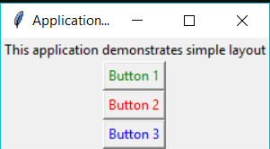
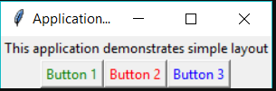

# 1.1 Introduction to Tkinter

## What Is A Graphical User Interface(GUI)

**GUI** is a desktop app which helps you to interact with the computers. They are used to perform different tasks in the desktops, laptops, other electronic devices, etc.., Here, we mainly talking about the laptops and desktops.

- **GUI** apps like **Text-Editors** are used to create, read, update and delete different types of files.

- **GUI** apps like **Sudoku, Chess, Solitaire, etc..,** are games which you can play.

- **GUI** apps like **Chrome, Firefox, Microsoft Edge, etc..,** are used to surf the **Internet**.

They are some different types of **GUI** apps which we daily use on the laptops or desktops. We are going to learn how to create those type of apps.

As this is an Introduction to GUI, we will create a simple **Calculator GUI** app.

## What Is Tkinter

**Tkinter** is an inbuilt **Python** module used to create simple **GUI** apps. It is the most commonly used module for **GUI** apps in the **Python**.

You don't need to worry about installation of the **Tkinter** module as it comes with **Python**default.

**Note:-**

- We are going to use **Python 3.6** version. So, kindly update **Python** if you're using below versions.

- To install **Python 3.6** Ubuntu follow this link [Install Python 3.6 in Ubuntu](http://ubuntuhandbook.org/index.php/2017/07/install-python-3-6-1-in-ubuntu-16-04-lts/)

- To install the latest version of **Python** in **Windows** go to [Python Official Website](https://www.python.org/downloads/) then, download and install the **exe** file.

- Go to [Python Official Download Page](https://www.python.org/downloads/), download **Mac OS X** and install in your machine.

- Follow this tutorial along with the practice so, that you can understand it very quickly.

- Don't copy the code. Try to write by modifying it as you like.

## Introduction To Tkinter

Run the following code to create a simple window with the text **Hello World!**.

**Steps:-**

- import the module **tkinter**.

- Initialize the window manager with the **tkinter.Tk()** method and assign it to a variable **window**. This method creates a blank window with close, maximize and minimize buttons.

- Rename the title of the window as you like with the **window.title(title_of_the_window)**.

- **Label** is used to insert some objects into the **window**. Here, we are adding a **Label** with some text.

- **pack()** attribute of the widget is used to display the **widget** in a size it requires.

- Finally, the **mainloop()** method to display the **window** until you manually close it.

```python
import tkinter

window = tkinter.Tk()
# to rename the title of the window
window.title("GUI")
# pack is used to show the object in the window
label = tkinter.Label(window, text = "Hello World!").pack()
window.mainloop()
```

That's a basic program to create a simple **GUI** interface. You will see a similar window like this.

# 1.2 Widgets and Layouts

## Tkinter Widgets

There are different types of **widgets** to the different types of elements in the **Tkinter**.

Let's see the brief introduction to all of these widgets in the **Tkinter**.

- **Button**:- **Button** widget is used to place the buttons in the **tkinter**.

- **Canvas**:- **Canvas** is used to draw shapes in your **GUI**.

- **Checkbutton**:- **Checkbutton** is used to create the check buttons in your application. You can select more than one option at a time.

- **Entry**:- **Entry** widget is used to create input fields in the **GUI**.

- **Frame**:- **Frame** is used as containers in the **tkinter**.

- **Label**:- **Label** is used to create a single line widgets like **text**, **images**, etc..,

- **Menu**:- **Menu** is used to create menus in the **GUI**.

We mentioned only some of the widgets that are present in **Tkinter**. You can find the complete list of widgets at official **Python** [documentation](https://docs.python.org/3/).

## Geometry Management

All widgets in the **tkinter** will have some geometry measurements. These measurements give you to organize the widgets and their parent frames, windows, etc..,

**Tkinter** has the following three Geometry Manager classes.

- **pack()**:- It organizes the widgets in the block, which mean it occupies the entire available width. It's a standard method to show the widgets in the window

- **grid()**:- It organizes the widgets in table-like structure. You will see details about **grid** later in this tutorial.

- **place()**:- It's used to place the widgets at a specific position you want.

## Organizing Layout And Widgets

### **a) Frame layout**

At the previous topic, we used “pack()” command to place labels at the window. The “pack()” command it is the simplest method to add something to the window. At this lesson, we will also use the “Button” widgets to demonstrate to you how we can apply different layouts to our window. Let’s create a simple program with one label and three buttons.  
 

```javascript
from tkinter import *
window = Tk()
window.title("Application 1")
text1 = Label(window, text = "This application demonstrates simple layout")
button1 = Button(window, text = "Button 1" , fg = "green")
button2 = Button(window, text = "Button 2" , fg = "red")
button3 = Button(window, text = "Button 3" , fg = "blue")
text1.pack()
button1.pack()
button2.pack()
button3.pack()
window.mainloop()
```



We can change the color of the text and the background color of the object by two different commands inside the brackets of the object. “fg” means foreground color of the object and “bg” means background color of the object.

You can use the colors "white", "black", "red", "green", "blue", "cyan", "yellow", and "magenta".

### b) How can we place objects in this way?



*To realize this layout of the objects we will use the widget called “Frame”. “Frame” widget allows us to group some objects together so that we can place them to a specific place. If we look carefully we can notice that label and three buttons are different groups.* 

Now to create “Frame” widget we should use variable to assign variable to the object “Frame”

```javascript
topFrame = Frame(window)
bottomFrame = Frame(window)
topFrame.pack()
bottomFrame.pack()
```

*Inside brackets of the “Frame” widget to which widget it will be assigned. And “Frame” is an object that should be placed on the window. That’s why we used “pack()” command to place them on the window.*

Now we should assign which object will depend on which group. So we will assign the label to “topFrame” and buttons to “bottomFrame”.

```ini
text1 = Label(topFrame , text = "This application demonstrates frame layout")
button1 = Button(bottomFrame, text = "Button 1" , fg = "green")
button2 = Button(bottomFrame, text = "Button 2" , fg = "red")
button3 = Button(bottomFrame, text = "Button 3" , fg = "blue")
```

*By this way we can assign different objects to different groups of widgets*

We should place them on the window, cause if you will run this program now, nothing will be shown. We will place objects by standard “pack()” command. Also, we can choose from which side object will be aligned. You should type “side = LEFT” inside “pack()”  brackets if you want to align object from the left side. So we have four sides which we can use to align objects: LEFT, RIGHT, TOP, BOTTOM. All of them should be typed by uppercase characters.

```scss
text1.pack()
button1.pack(side = LEFT)
button2.pack(side = LEFT)
button3.pack(side = LEFT)
```

*We type side for buttons, cause we should align them from left to right*

```javascript
from tkinter import *
window = Tk()
window.title("Application 2")

topFrame = Frame(window)
bottomFrame = Frame(window)
topFrame.pack()
bottomFrame.pack()

text1 = Label(topFrame, text = "This application demonstrates frame layout")
button1 = Button(bottomFrame, text = "Button 1" , fg = "green" )
button2 = Button(bottomFrame, text = "Button 2" , fg = "red")
button3 = Button(bottomFrame, text = "Button 3" , fg = "blue")

text1.pack()
button1.pack(side = LEFT)
button2.pack(side = LEFT)
button3.pack(side = LEFT)

window.mainloop()
```

*Finally your code should be in this way*
